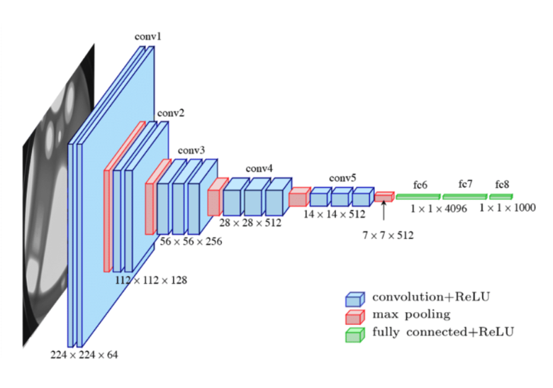

# vgg16-pytorch
Testbed Code for VGG16 Pipeline Implementation using PyTorch [Distributed AI]

## Building architecture


<!-- Trong repository này chứa các cách cắt mô hình DenseNet khác nhau. Index của khối tương ứng vị trí cắt khối đó. Ví dụ trong `./pipeline_parallelism_3dev/`, file `./pipeline_3_5.py` nghĩa là dùng trên 3 thiết bị, phần cắt tại khối **3** và **5** -->

## Running model
Below is the bash code that runs the model
```bash
#!/bin/bash

# Variables
split_size=128
mlp_size=1000
mode='CIFAR'
user='master'
rank=0
master_addr='192.168.101.87'
interface='eno2'

# Training with CIFAR dataset
if [ $mode == 'CIFAR' ]
then
	mkdir -p ./CIFAR_log/split_$split_size
	sudo tegrastats --interval 1000 --logfile ./CIFAR_log/split_$split_size/$user\_usage.log &
	python3 log_bandwidth.py ./CIFAR_log/split_$split_size/$user\_throughput.log &
    # sudo python3 packet_sniffer.py --filename=$user\_$split_size ----ip1=192.168.101.31 --ip2=192.168.101.21 --ip3=192.168.101.24 &
	python3 vgg16_pipeline_CIFAR.py --rank=$rank --master_addr=$master_addr --master_port=23456 --world_size=3 --interface=$interface --split_size=$split_size
fi
```

Therein:
- `master_addr=` IP address of master device - start device
- `rank=` is set to the device transmission order 0-1-2...
- `--world_size` is the number of devices

### Measure parameters

```
python3 log_bandwidth.py ...bw
sudo tegrastats --interval 1000 --logfile ...data
```
